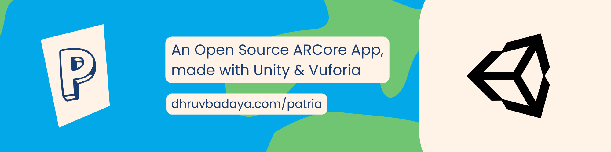

# 🌍 Patria: An Open Source Augmented Reality Game, powered by Unity and Vuforia.

Welcome to the Patria GitHub repository. Patria word comes from the Latin word, Patrium, which means Country. Patrium is an open-source augmented reality-based game, made with Unity and Vuforia. In this game, you are given the name of the country and have to pinpoint the country on the globe. 

## 📷 Screenshots 

 &nbsp;&nbsp;&nbsp;
 &nbsp;&nbsp;&nbsp;
 &nbsp;&nbsp;&nbsp;

## 🎮 How to Play?

| Step | Description                                                                                                                                                                                                                                                                                                                                                        |
|-------|--------------------------------------------------------------------------------------------------------------------------------------------------------------------------------------------------------------------------------------------------------------------------------------------------------------------------------------------------------------|
| Download     | To play this game, first of all, download the application from here: [Download Here](https://github.com/lightlessdays/Patria-AR/raw/main/Patria.apk?download=true).                                                                                                                                                                                          |
| Open     | Now open the application on your phone. If you do not see a black screen, proceed to the next step. If you see a black screen, make sure that you have given appropriate camera permissions to the application. If you have enabled camera permissions, then exit the app reopen the app, and wait for 3 seconds. The camera on the application should open. |
| Add Marker     | Next, point the application's camera towards the following image: [Image Link](marker.jpeg)                                                                                                                                                                                                                                                                  |
| Play     | A globe should pop up. On the application, you will see the name of a country. You have to select that country on the globe. If you do that, you may proceed. Else, you selected the wrong country.                                                                                                                                                          |                                                                         |

## 🤝 Contributing

We welcome contributions from the community to help improve Patria. To contribute, please follow these guidelines:

- Fork this repository.
- Create a new branch for your feature or bug fix: `git checkout -b feature/your-feature-name`
- Make your changes and commit them: `git commit -m "Description of your changes"`
- Push your changes to your fork: `git push origin feature/your-feature-name`
- Open a pull request to the `main` branch of this repository.

For more detailed information on contributing, please read our [Contributing Guidelines](CONTRIBUTING.md).

## ⚖️ Code of Conduct

We want to ensure a welcoming and inclusive community around Patria AR. We have a [Code of Conduct](CODE_OF_CONDUCT.md) in place to set the expectations for respectful and collaborative behavior. Please read and adhere to it when participating in this project.

## 🪪 License

MIT License

Copyright (c) 2023 Dhruv Badaya

Permission is hereby granted, free of charge, to any person obtaining a copy
of this software and associated documentation files (the "Software"), to deal
in the Software without restriction, including without limitation the rights
to use, copy, modify, merge, publish, distribute, sublicense, and/or sell
copies of the Software, and to permit persons to whom the Software is
furnished to do so, subject to the following conditions:

The above copyright notice and this permission notice shall be included in all
copies or substantial portions of the Software.

THE SOFTWARE IS PROVIDED "AS IS", WITHOUT WARRANTY OF ANY KIND, EXPRESS OR
IMPLIED, INCLUDING BUT NOT LIMITED TO THE WARRANTIES OF MERCHANTABILITY,
FITNESS FOR A PARTICULAR PURPOSE AND NONINFRINGEMENT. IN NO EVENT SHALL THE
AUTHORS OR COPYRIGHT HOLDERS BE LIABLE FOR ANY CLAIM, DAMAGES OR OTHER
LIABILITY, WHETHER IN AN ACTION OF CONTRACT, TORT OR OTHERWISE, ARISING FROM,
OUT OF OR IN CONNECTION WITH THE SOFTWARE OR THE USE OR OTHER DEALINGS IN THE
SOFTWARE.
